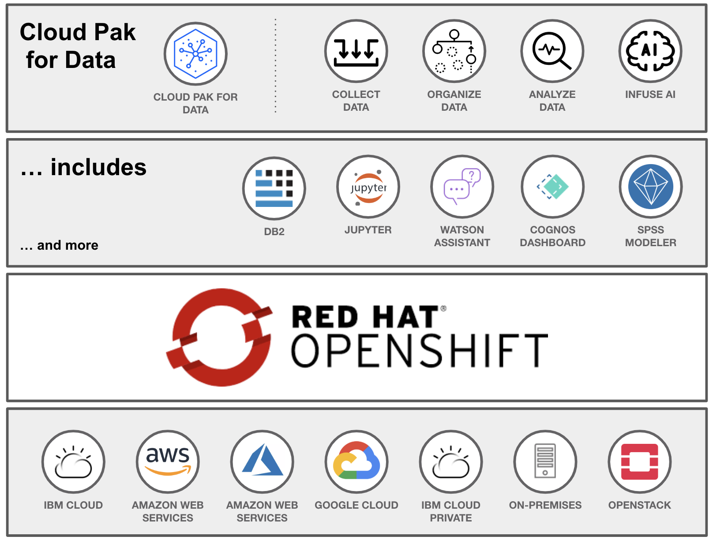

## Analyzing Telco Customer Churn with Cloud Pak for Data on OpenShift

Welcome to our workshop! In this workshop we'll be using the Cloud Pak for Data platform to Collect Data, Organize Data, Analyze Data, and Infuse AI into our applications. The goals of this workshop are:

* Collect and virtualize data
* Visualize data with Data Refinery
* Create and deploy a machine learning model
* Monitor the model
* Create a Python app to use the model

### About this workshop

The introductory page of the workshop is broken down into the following sections:

* [Agenda](#agenda)
* [Compatability](#compatability)
* [About Cloud Pak for Data](#about-cloud-pak-for-data)
* [Credits](#credits)

## Agenda

|   |   |
| - | - |
| [Exercise 0: Pre-work](exercise-0/README.md) | Creating a project, downloading the data set, seeding a database |
| [Exercise 1: Data Connection and Virtualization for Admins](exercise-1/README.md) | Creating a new connection, virtualizing the data, importing the data into the project |
| [Exercise 2: Data Visualization with Data Refinery](exercise-2/README.md) | Refining the data, vizualizing and profiling the data |
| [Exercise 3: Machine Learning with Jupyter](exercise-3/README.md) | Building a model with Spark, deploying the model with Watson Maching Learning, testing the model with a Python Flask app |
| [Exercise 4: Monitoring models with OpenScale](exercise-4/README.md) | Monitor the model with Watson OpenScale |

## Compatability

This workshop has been tested on the following platforms:

* **macOS**: Mojave (10.14), Catalina (10.15)

## About Cloud Pak for Data

Cloud Pak for Data represents an all-in-one platform for all your data needs. Cloud Pak for data tries to eliminate silos between Architect, Data Scientist, Developer, and Data Stewards. Cloud Pak for Data helps to streamline work by creating a pipeline for collecting, organizing, analyzing, and consuming data.

### A few other noteworthy mentions

Cloud Pak for Data:

* ... has a [new CP4D 2.5 version](https://www.ibmbigdatahub.com/blog/announcing-cloud-pak-for-data-2-5)
* ... is installed on Red Hat OpenShift providing an enterprise quality container platform
* ...you can choose the services that you want to run on Cloud Pak for Data. This means you are running only the services that are important for your line of business.
* ...you can extend the functionality of IBM Cloud Pak for Data by installing services and by integrating Cloud Pak for Data with other applications.
* ... added [Services](http://rhea.svl.ibm.com:9081/support/knowledgecenter/SSQNUZ_2.5.0/cpd/svc/services.html) include:
  * Watson Assistant
  * Watson OpenScale
  * R Studio
  * Data Virtualization
  * any many more
* ... can be deployed on any major cloud provider (IBM, AWS, Azure, GCP)
* ... provides a free 7-day trial -- [Cloud Pak Experience](https://www.ibm.com/cloud/garage/cloud-pak-experiences/)

## Credits

This workshop was primarily written by [Scott D'Angelo](https://github.com/scottdangelo) and [Steve Martinelli](https://github.com/stevemar). Many other IBMers have contributed to help shape, test, and contribute to the workshop.

* [Mark Sturdevant](https://github.com/markstur)
* [Omid Meh](https://github.com/omidmeh)
* [Samaya Madhavan](https://github.com/samayamadhavan)
