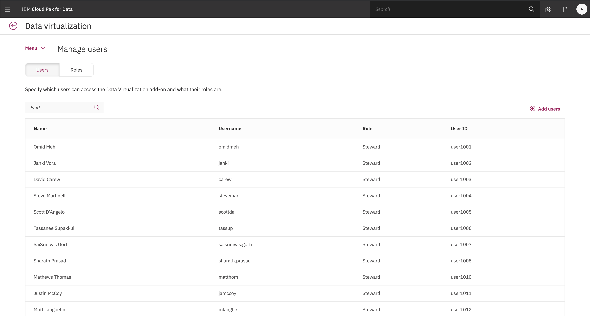
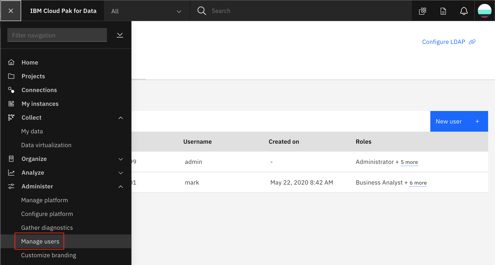

# Admin guide

> **NOTE**: This section requires `Admin` user access to the Cloud Pak for Data cluster. An administrator will present this part for the workshop.

## Virtualize Db2 data with Data Virtualization

For this section we'll now use the Data Virtualization tool to import the data from Db2 Warehouse, which is now exposed as an Connection in Cloud Pak for Data.

### Add a Data Source to Data Virtualization

To launch the data virtualization tool, go the (☰) menu and click *Collect* and then *Virtualized data*.

At the empty overview, click *Add* and choose *Add remote connector*.

Select the data source we made in the previous step, and click *Next*.

The new connection will be listed as a data source for data virtualization.

### Start virtualizing data

In this section, since we now have access to the Db2 Warehouse data, we can virtualize the data to our Cloud Pak for Data project. Click on the *Menu* button and choose *Virtualize*.

Several tables will appear (many are created as sample data when a Db2 Warehouse instance is provisioned) in the table. Find the tables you created earlier, the instructions suggested naming them: `CUSTOMER`, `PRODUCT` and `BILLING`. Once selected click on *Add to cart* and then on *View Cart*.

The next panel prompts the user to choose which project to assign the data to, choose the project you created in the previous exercise. Click *Virtualize* to start the process.

You'll be notified that the virtual tables have been created! Let's see the new virtualized data from the Data Virtualization tool by clicking *View my data*.

### Join the virtualized data

Now we're going to **join** the tables we created so we have a merged set of data. It will be easier to do it here rather than in a notebook where we'd have to write code to handle three different data sets. Click on any two tables (`PRODUCTS` and `BILLING` for instance) and click the *Join view* button.

To join the tables we need to pick a key that is common to both data sets. Here we choose to map `customerID` from the first table to `customerID` on the second table. Do this by clicking on one and dragging it to another. When the line is drawn click on *Join*.

In the next panel we'll give our joined data a name, I chose `billing+products`, then review the joined table to ensure all columns are present and only one `customerID` column exists. Click *Next* to continue.

Next we choose which project to assign the joined view to, choose the project you created in the previous exercise. Click *Create view* to start the process.

You'll be notified that the join has succeeded! Click on *View my data*. to repeat this again so we have all three tables.

**IMPORTANT** Repeat the same steps as above, but this time choose to join the new joined view (`billing+products`) and the last virtualized table (`CUSTOMERS`), to create a new joined view that has all three tables, let's call it `billing+products+customers`. Switching to our project should show all three virtualized tables, and two joined tables. Do not go to the next section until this step is performed.

### Assign the "Steward" role to the attendees

Go to *Data Virtualization* option from the menu. Click on *Manage users*

Click on *Add user* and ensure all users have the *Steward* role.

---

## Adding users to the cluster

From the hamburger menu, click manage users, then add user!

