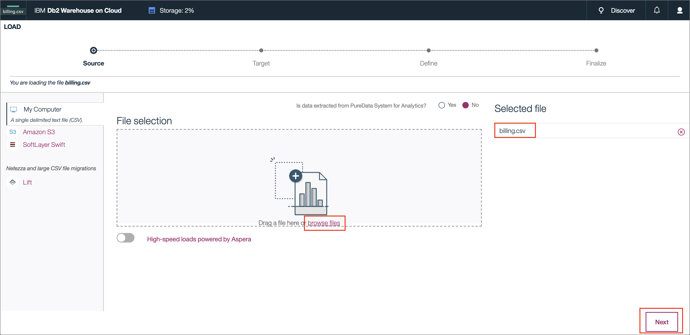
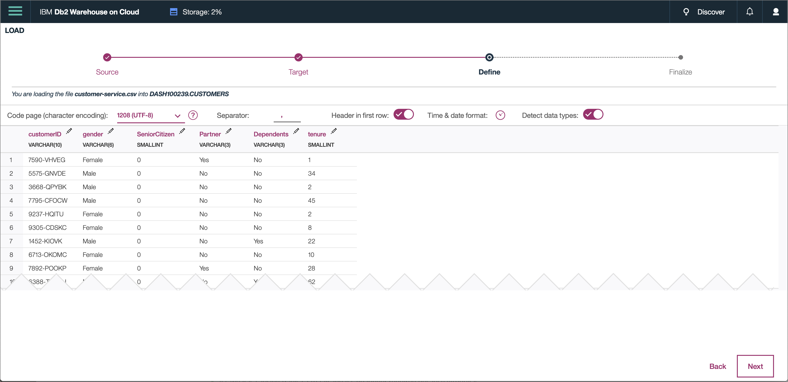

# Pre-work

## Setting up a project

> **IMPORTANT** Your instructor will provide a URL and credentials to log into Cloud Pak for Data!

1. Log into Cloud Pak for Data.

   

1. Go the hamburger menu and click *Projects*

1. Create a new project, give it a unique name.

## About the data set

The data set used for this workshop is derived from [Kaggle](https://www.kaggle.com/blastchar/telco-customer-churn). It is originally from Watson Analytics, and looks at customer churn for a Telecommunication company. The data is split into three CSV files and are located in the [data](../../data) directory of this repository.

**[billing.csv](billing.csv)**

This file has the following attributes:

* Customer ID
* Amount $

**[customer-service.csv](customer-service.csv)**

* Customer ID
* Senior, Y/N

**[products.csv](products.csv)**

* Customer ID
* Has cable, Y/N

## (Optional) Seeding our Db2 database

1. Log into (or sign up for) [IBM Cloud](https://cloud.ibm.com).

1. Create a [Db2 Warehouse](https://cloud.ibm.com/catalog/services/db2-warehouse) service on IBM Cloud. Choose the `Entry` plan as it is compatible with a `Lite` account.

1. Once created click on *Open Console*.

   

1. overview

   

1. Load csv

   

1. config?

   

1. start loading

   

1. loaded

   

1. extra options with customers and products

  |   |   |
  | - | - |
  |  |  |

1. Back on IBM Cloud, check credentials

  
