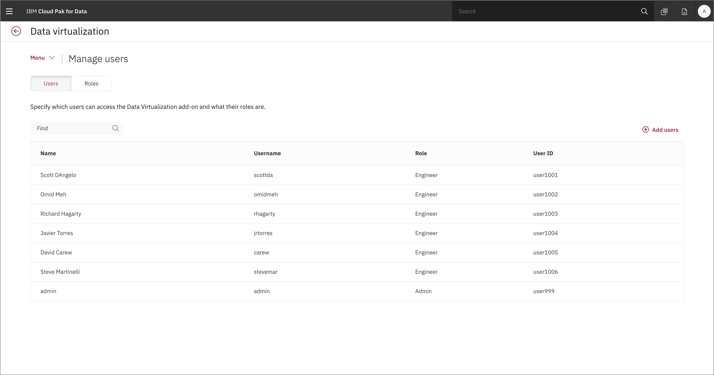
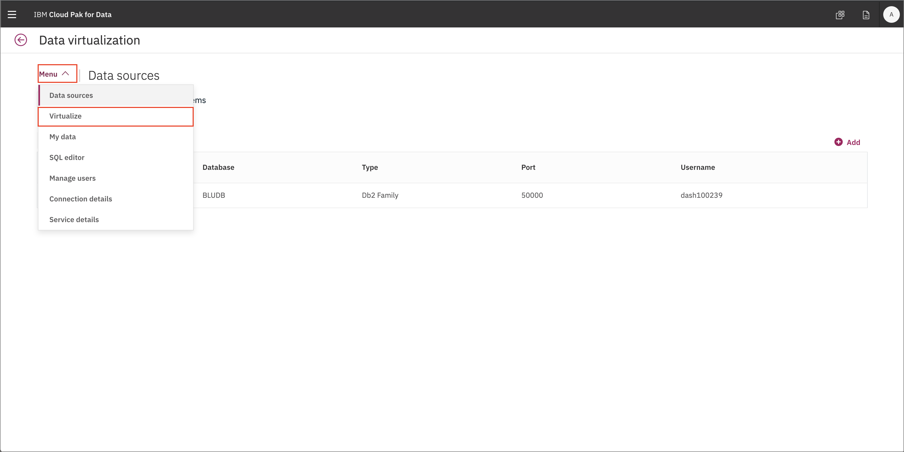

# Exercise 1: Data Analysis

This section is broken up into the following steps:

1. [Add a new Data Source connection](#add-a-new-data-source-connection)
1. [Virtualize Db2 data with Data Virtualization](#virtualize-db2-data-with-data-virtualization)
1. [Visualize data with Cognos Dashboards](#visualize-data-with-cognos-dashboards)

## Add a new Data Source connection (Admin only)

To add a new data source, go the (☰) menu and click on the *Connections* option.

At the empty overview, click *Add connection*.

Start by giving your new *Connection* a name and select *Db2 Warehouse on Cloud* as your connection type. More fields should apper. Fill the new fields with the same credentials for your own Db2 Warehouse connection from the previous section (or ask your instructor for shared credentials).

The new connection will be listed in the overview.

> **IMPORTANT**: A note to the instructors of this workshop. At this point go to the *Virtualized Data* option and grant at least *Steward* access to all users participating in the workshop.

## Virtualize Db2 data with Data Virtualization

To launch the data virtualization tool, go the (☰) menu and click *Collect* and then *Virtualized data*.

At the empty overview, click *Add* and choose *Add remote connector*.

Select the data source we made in the previous step, and click *Next*.

The new connection will be listed as a data source for data virtualization.

From here, click on the *Menu* button and choose *Virtualize*.

Several tables will appear (many are created as sample data when a Db2 Warehouse instance is provisioned) in the table. Find the tables you created earlier, the instructions suggested naming them: `CUSTOMER`, `PRODUCT` and `BILLING`. Once selected click on *Add to cart* and then on *View Cart*.

The next panel prompts the user to choose which project to assign the data to, choose the project you created in the previous exercise. Click *Virtualize* to start the process.

You'll be notified that the virtual tables have been created! Let's see the new virtualized data from the Data Virtualization tool by clicking *View my data*.

Before going to the next let's **join** the tables we created so we have a merged set of data. It will be easier to do it here rather than in a notebook where we'd have to write code to handle three different data sets. Click on any two tables (`PRODUCTS` and `BILLING` for instance) and click the *Join view* button.

To join the tables we need to pick a key that is common to both data sets. Here we choose to map `customerID` from the first table to `customerID` on the second table. Do this by clicking on one and dragging it to another. When the line is drawn click on *Join*.

In the next panel we'll give our joined data a name, I chose `billing+products`, then review the joined table to ensure all columns are present and only one `customerID` column exists. Click *Next* to continue.

Next we choose which project to assign the joined view to, choose the project you created in the previous exercise. Click *Create view* to start the process.

You'll be notified that the join has succeeded! Click on *View my data*. to repeat this again so we have all three tables.

**IMPORTANT** Repeat the same steps as above, but this time choose to join the new joined view (`billing+products`) and the last virtualized table (`CUSTOMERS`), to create a new joined view that has all three tables, let's call it `billing+products+customers`. Switching to our project should show all three virtualized tables, and two joined tables. Do not go to the next section until this step is performed.

## Visualize data with Cognos Dashboards

To be completed
