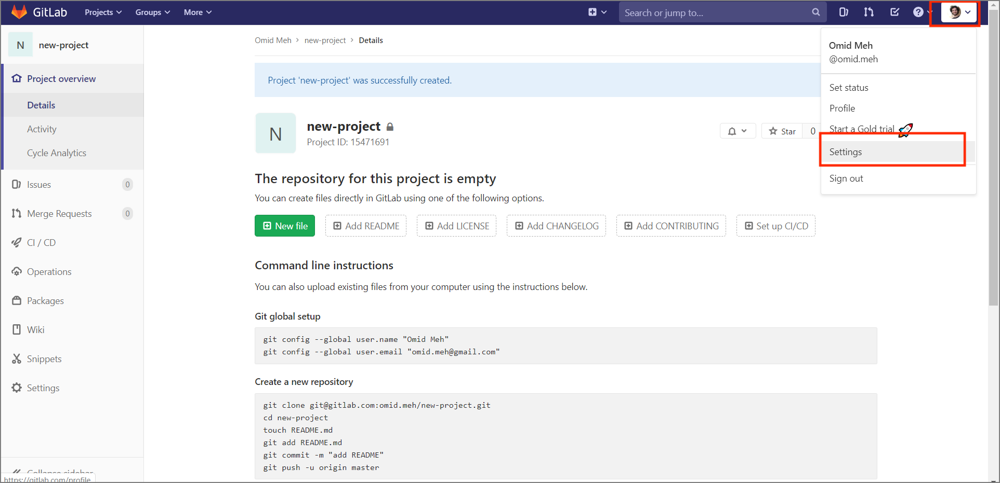
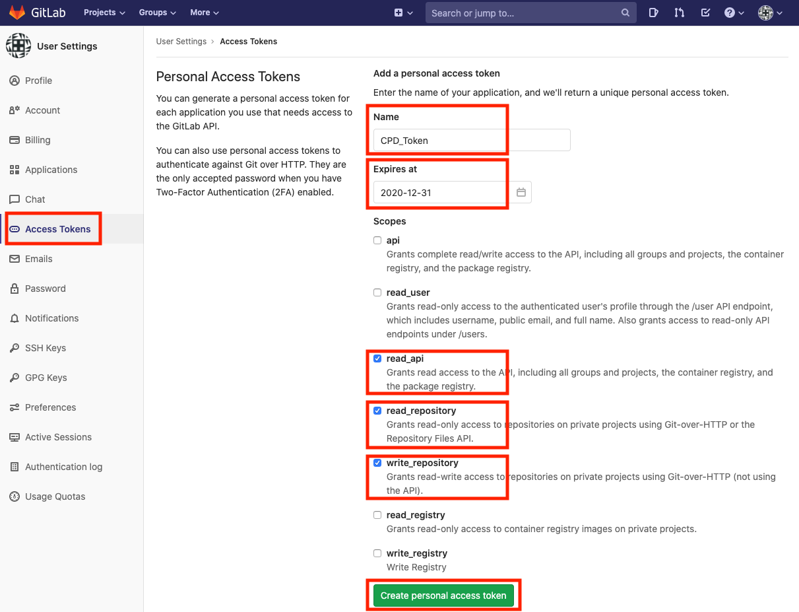
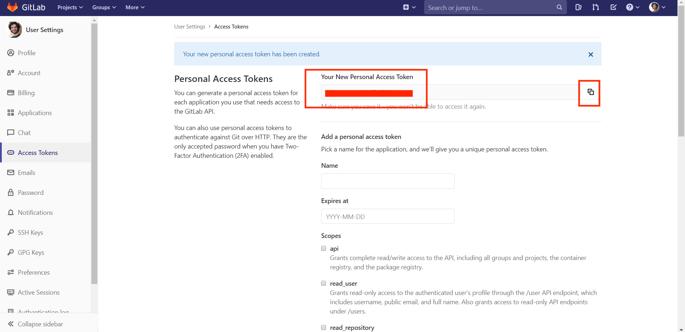
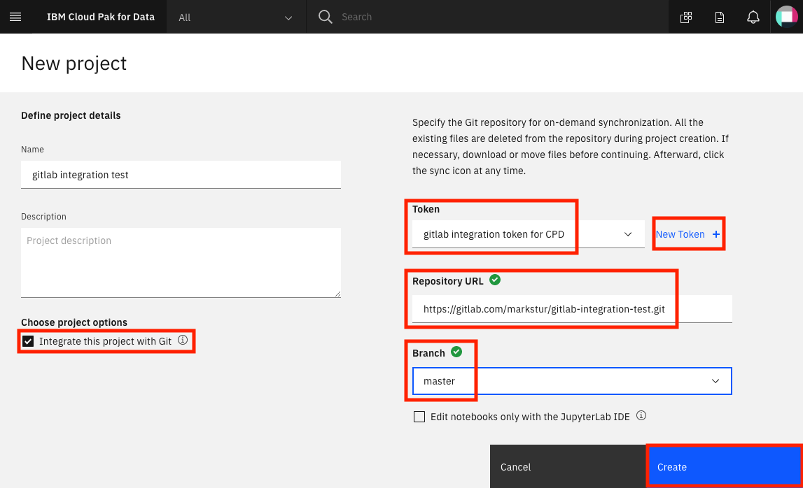
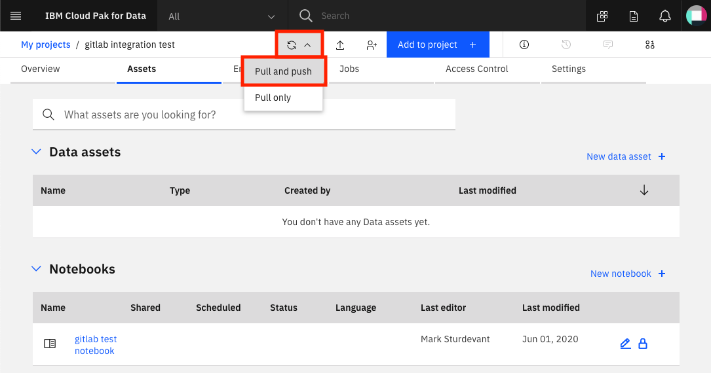
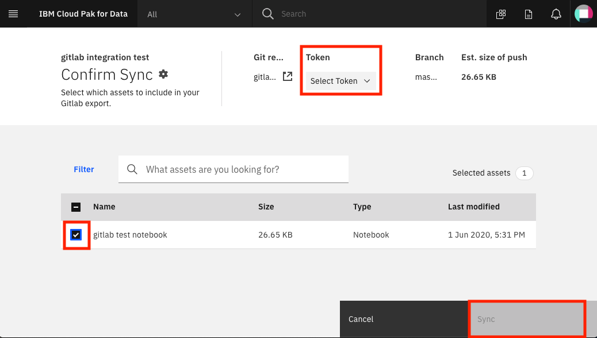

# Git repository integration

A Cloud Pak for Data project can be integrated with a git repository.

### Generate a token in GitLab

To create a token for Gitlab, login to [GitLab](https://about.gitlab.com/), click on your user account in the top right and choose `Settings`:



From the left navigation bar select `Access tokens` and fill in the *name*, *expiration date*, and check the boxes for *read_repository* and *write_repository*. Finally, click `Create personal access token` button:



On the resulting page, you'll see your personal access token. Copy this.

> NOTE: This token gives access to your git repository. Do not share with anyone.



Now go back to the Cloud Pak for Data *Create project* page and we'll add the token.

### Create a project with git integration

Go the (☰) menu and click *Projects*


Click on *New project*


Create a new project, choose `Analytics project`. Give the project a name.

Click the box for `Integrate this project with git`. Add the token that you have created, and then select it. Put in the repository URL, Select a branch, and click `Create`.



### Create assets and push to git

Now if we create an asset in the project, we can push to git.

At the project overview, either click the `+Add to project` button, and choose `Notebook`, or to the right of *Notebooks* click `+ New notebook`:


On the next panel select the *From URL* tab, give your notebook a name, provide the following URL, and choose the Python 3.6 environment:

```bash
https://raw.githubusercontent.com/IBM/cloudpakfordata-telco-churn-workshop/master/notebooks/TelcoChurnICP4D.ipynb
```

Now, go back to the top-level project page, click the "rectangular arrow" sync-icon, and choose `Pull and Push`:



On the *Confirm Sync* page, select your token, check the box for your notebook, and click `Sync`:



The next screen will verify "Did you remove credentials from assets?". After confirming this, click `Continue export`.

After syncing, the screen will show Success. You can click `Back to project`.

You can integrate git into your workflow in your usual way, syncing with teammates via 'git pull' and using 'git push' to upload your changes to the git remote repository.

