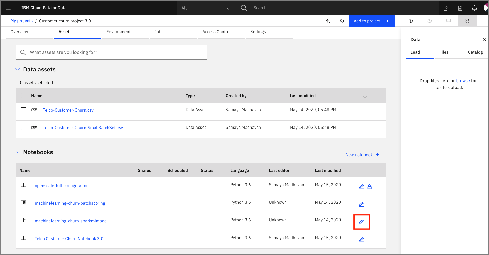
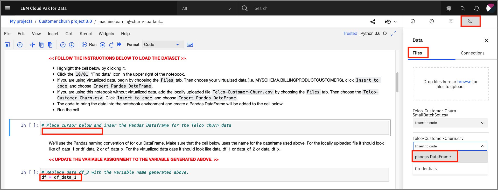

# Machine Learning in Jupyter Notebook

In this module, we will go through the process of exploring our data set and building a predictive model that can be used to determine the likelyhood of a customer churning. For this use case, the machine learning model we are building is a classification model that will return a prediction of Yes (the customer will churn) or No (the customer will not churn). The approach we will take in this lab is to some fairly popular libraries / frameworks to build the model in Python using a Jupyter notebook. Once we have built the model, we will make it available for deployment so that it can be used by others.

This module is broken up into the following steps:

1. [Build a model](#1-build-a-model)
1. [Deploying the model](#2-deploying-the-model)
1. [Testing the model](#3-testing-the-model)

>*Note: The lab instructions below assume you have a project and a deployment space already. If not, follow the instructions in the pre-work section to create a project and a space.*

## 1. Build a model

For this part of the exercise we're going to use a Jupyter notebook to create the model. The Jupyter notebook is already included as an asset in the project you imported earlier.

>*Note: The Jupyter notebook included in the project has been cleared of output. If you would like to see the notebook that has already been completed with output: **Notebook with output**: [with-output/TelcoChurnICP4DOutput.ipynb](https://github.com/IBM/cloudpakfordata-telco-churn-workshop/blob/master/notebooks/with-output/TelcoChurnICP4DOutput.ipynb)*

Open the notebook:

* From the project overview page, *click* on the `Assets` tab to open the assets page where your project assets are stored and organized.

* Scroll down to the `Notebooks` section of the page and *Click* on the pencil icon at the right of the `machinelearning-churn-sparkmlmodel` notebook.



When the Jupyter notebook is loaded and the kernel is ready, we will be ready to start executing it in the next section.


### Run the notebook

Spend an minute looking through the sections of the notebook to get an overview. A notebook is composed of text (markdown or heading) cells and code cells. The markdown cells provide comments on what the code is designed to do.

You will run cells individually by highlighting each cell, then either click the `Run` button at the top of the notebook or hitting the keyboard short cut to run the cell (Shift + Enter but can vary based on platform). While the cell is running, an asterisk (`[*]`) will show up to the left of the cell. When that cell has finished executing a sequential number will show up (i.e. `[17]`).

**Please note that some of the comments in the notebook are directions for you to modify specific sections of the code. Perform any changes as indicated before running / executing the cell.**

#### Notebook sections

With the notebook open, you will notice:

* Section `1.0 Install required packages` will install some of the libraries we are going to use in the notebook (many libraries come pre-installed on Cloud Pak for Data). Note that we upgrade the installed version of Watson Machine Learning Python Client. Ensure the output of the first code cell is that the python packages were successfully installed.

* Section `2.0 Load and Clean data` will load the data set we will use to build out machine learning model. In order to import the data into the notebook, we are going to use the code generation capability of Watson Studio.

  * Highlight the code cell below by clicking it. Ensure you place the cursor below the `import pandas as pd` line.
  * Click the 10/01 "Find data" icon in the upper right of the notebook to find the data asset you need to import.
  * If you are using virtualized data, then choose your virtualized merged view (i.e. User999.BILLINGPRODUCTCUSTOMERS). If you are using this notebook without virtualized data, you can use the `Customer-Churn.csv` CSV file version of the data set that has been included in the project.
  * For your dataset, Click `Insert to code` and choose `Insert Pandas DataFrame`. The code to bring the data into the notebook environment and create a Pandas DataFrame will be added to the cell below.
  * Run the cell and you will see the first five rows of our dataset.




> **IMPORTANT**: Since we are using generated code to import the data, you will need to update the next cell to assign the `df` variable. Copy the variable that was generated in the previous cell ( it will look like `df=data_df_1`, `data_df_2`, etc) and assign it to the `df` variable (for example `df=df_data_1`).

* Continue to run the remaining cells in section 2 to explore and clean the data.

* Section `3.0 Create a model` cells will run through the steps to build a model pipeline.

  * We will split our data into training and test data, encode the categorial string values, create a model using the Random Forest Classifier algorithm, and evaluate the model against the test set.
  * Run all the cells in section 3 to build the model.


#### Save the model

* Section `4.0 Save the model` will save the model to your project.

* We will be saving and deploying the model to the Watson Machine Learning service within our Cloud Pak for Data platform. In the next code cell, be sure to update the `wml_credentials` variable.

  * The url should be the hostname of the Cloud Pak for Data instance.
  * The username and password should be the same credentials you used to log into Cloud Pak for Data.

* You will update the `MODEL_NAME` and `DEPLOYMENT_SPACE_NAME` variables. Use a unique and easily identifiable model name.

```python
MODEL_NAME = "user123 customer churn model"
DEPLOYMENT_SPACE_NAME = "Name you used for deployment space"
```

* Continue to run the cells in the section to save the model to Cloud Pak for Data.

**We've successfully built and saved a machine learning model programmatically. Congratulations!**

> **Important**: *Make sure that you stop the kernel of your notebook(s) when you are done, in order to conserve resources! You can do this by going to the Asset page of the project, selecting the notebook you have been running and selecting to `Stop Kernel` from the Actions menu. If you see a lock icon on the notebook, click it to unlock the notebook so you can stop the kernel.*
> 

## Conclusion

In this section we covered one approach to building machine learning models on Cloud Pak for Data. We have seen::

* How to build a model using Jupyter Notebook
* Saving models using the Watson Machine Learning SDK.

With this knowledge you should feel right at home within the Jupyter notebook. Moreover, you now know how to build a model and use it in a real life scenario.
