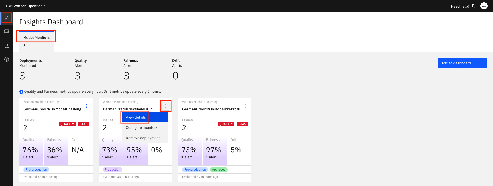
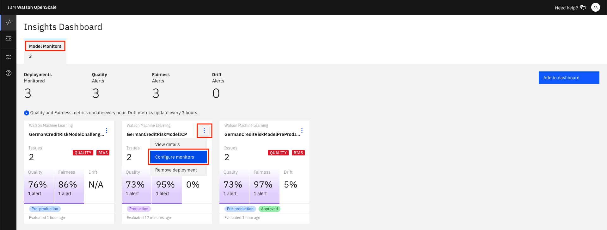

# Monitoring models with OpenScale GUI tool

This exercise shows a few of the features of the OpenScale GUI tool. It is presumed that OpenScale and Watson Machine Learning have already been configured.

## Use the insights dashboard

Open the `Services` tab by clicking the icon in the upper right. Go to the `OpenScale` tile under the `AI` category and click `Open`:

Click on the left-hand menu icon for `Insights`, make sure that you are on the `Model monitors` tab, and then choose the tile for your configured model (or the 3-dot menu on the tile and then `View Details`:

You will see the triangle with `!` under `Fairness` -> `Sex`.

By moving your mouse pointer over the graph, you can see the values change, and which contains bias. Click one spot to veiw the details. Later, we'll click `Configure Monitors` to get a Fairness endpoint:

Once you open the details page, you can see more information:

Click on `View Transactions` to drill deeper:

Now, go back to the *Insights Dashboard* page by clicking on the left-hand menu icon for `Insights`, make sure that you are on the `Model monitors` tab, and then choose the tile for your configured model (or the 3-dot menu on the tile and then `Configure monitors`:

Click the `Fairness` menu, then the `Debias Endpoint` tab:

Then scroll down for code examples on how to use the Fairness Debiased endpoint:

Similarly, you can choose the `Quality` menu and choose the `Feedback` tab to get code for Feedback Logging.

### Examine an individual transaction

Click on the left-hand menu icon for `Explain a transaction` and click one of the transactions that have been run. Alternatelyl, enter the transaction UID you copied previously into the search bar, if you've run the `Run the OpenScale notebook` code.

> NOTE: Each time you create the Explainibility data, the perterbation algorithm is sending 1000's of requests to the deployed Machine Learning REST endpoint, so the first time this is done can take a few seconds.

From the info icon next to `Details`:
"Explanations show the most significant factors when determining an outcome. Classification models also include advanced explanations. Advanced explanations are not available for regression, image, and unstructured text models."

Click on the info icon next to `Minimum changes for No Risk outcome` and look at the feature values:
"Pertinent Negative
If the feature values were set to these values, the prediction would change. This is the minimum set of changes in feature values to generate a different prediction. Each feature value is changed so that it moves towards its median value in the training data."

Click on the info icon next to `Maximum changes allowed for the same outcome` and look at the feature values:
"Pertinent Positive
The prediction will not change even if the feature values are set to these values. This is the maximum change allowed while maintaining the existing prediction. Each feature value is changed so that it moves towards its median value in the training data."

You can see under `Most important factors influencing prediction` the Feature, Value, and Weight of the most important factors for this score.

A full breakdown of the factors contributing to either "Risk" or "No Risk" are at the bottom.
