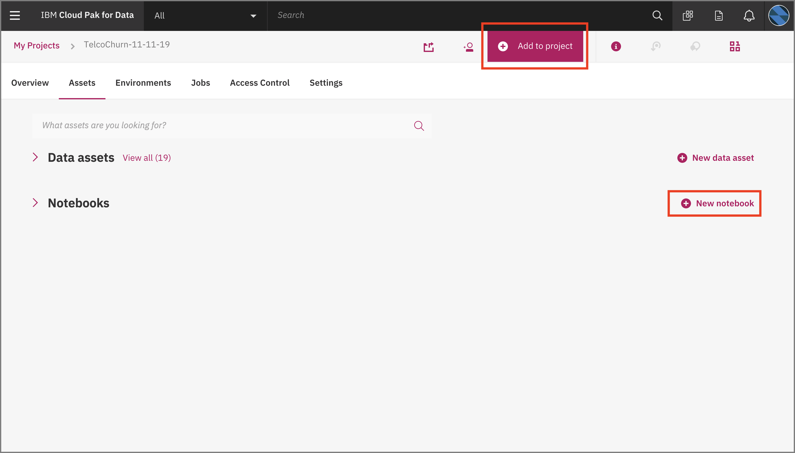
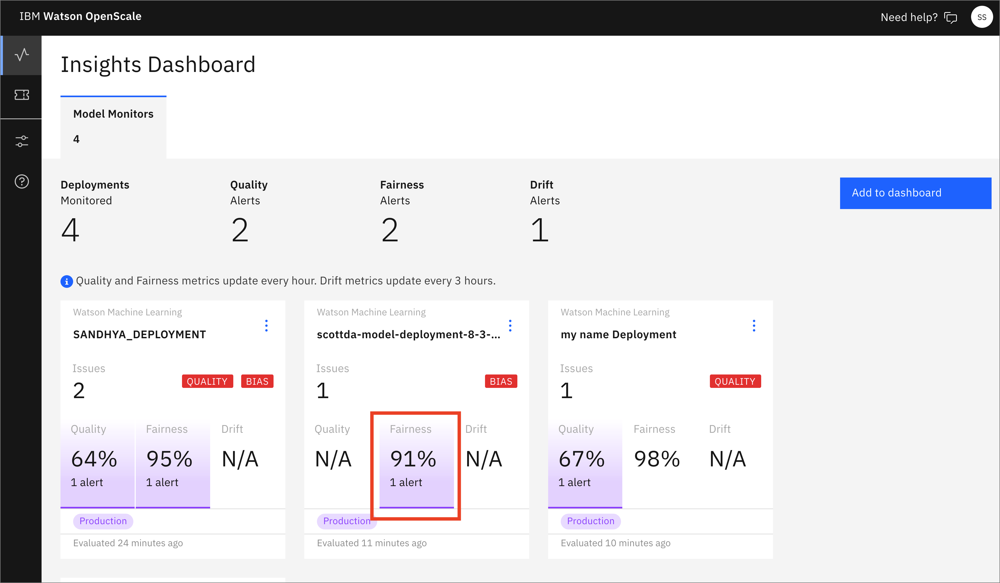
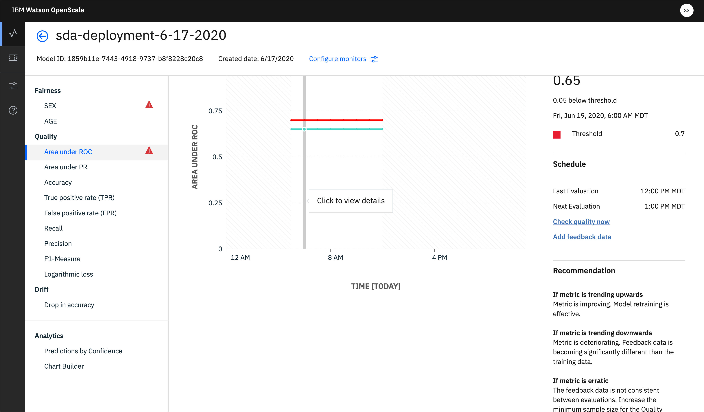
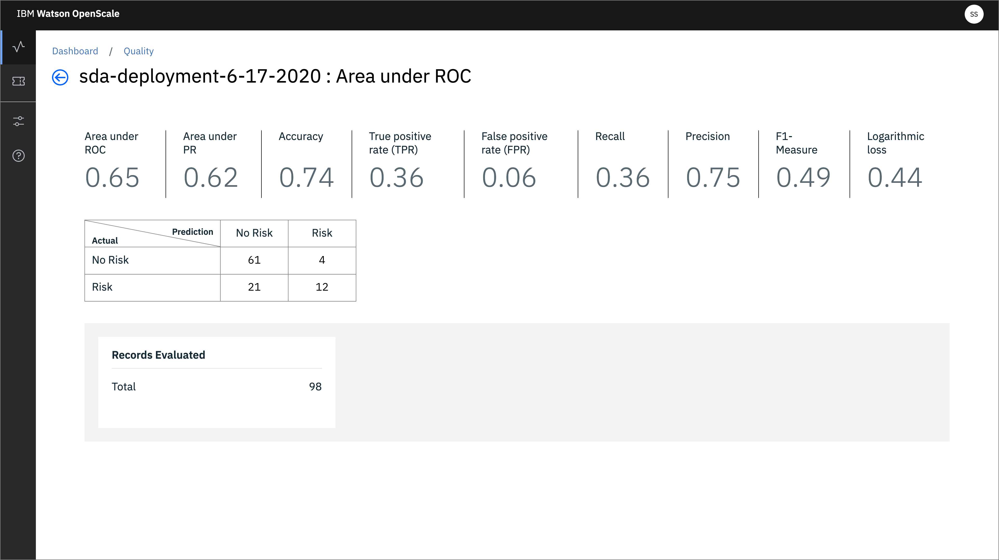
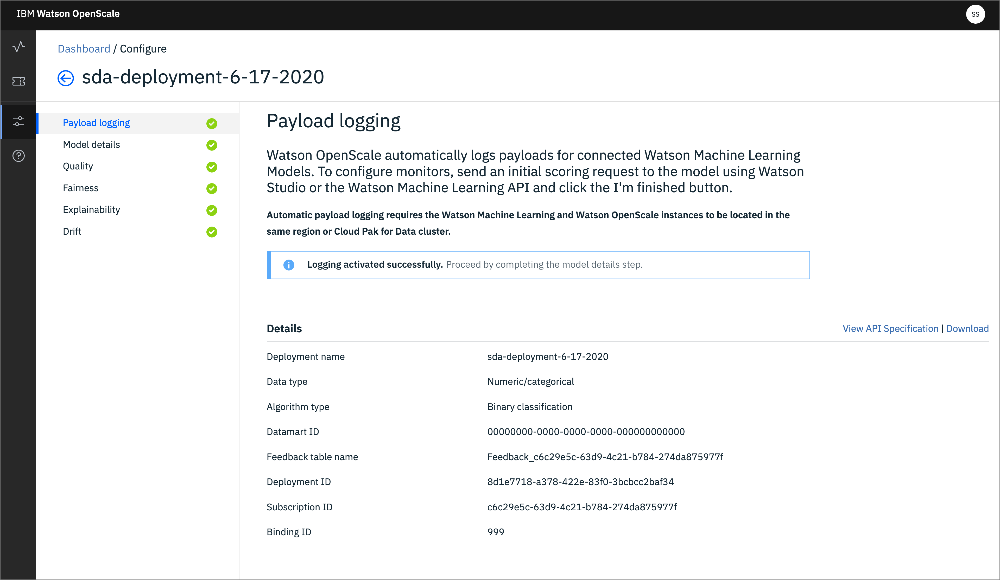

# Configure Quality monitoring and Feedback logging

Watson OpenScale utilizes several monitors to gather data about machine learning inferences and the GUI tool can then present that data in a form that is useful. In this sub-module we will use a Jupyter notebook to configure the monitor for Quality and enable Feedback logging.

## Steps for OpenScale Quality monitor and Feedback logging

The submodule contains the following steps:

1. Open the notebook
1. Update credentials
1. Run the notebook
1. Begin to Explore the Watson OpenScale UI

## 2. Open the notebook

If you [Created the Project](https://ibm-developer.gitbook.io/cloudpakfordata-telco-churn-workshop/getting-started/pre-work#create-a-new-project) using the [Customer-Churn-Project.zip](https://github.ibm.com/IBMDeveloper/cp4d-workshop-telco-churn/blob/master/projects/Customer-Churn-Project.zip) file, your notebook will be present in that project, under the `Assets` tab:

TODO: Replace with new image


You may now skip to the next step [Update credentials](#2-update-credentials)

## Import the notebook (If you are not using the Project Import pre-work steps)

> NOTE: You should probably not need this step, and should only perform it if instructed to.

If, for some reason, you are not using the [Created the Project](https://ibm-developer.gitbook.io/cloudpakfordata-telco-churn-workshop/getting-started/pre-work#create-a-new-project) step in the Pre-work to import [Customer-Churn-Project.zip](https://github.ibm.com/IBMDeveloper/cp4d-workshop-telco-churn/blob/master/projects/Customer-Churn-Project.zip), then you will need to import the notebook file by itself. Use the following steps for that.

At the project overview click the *New Asset* button, and choose *Add notebook*.



On the next panel select the *From URL* tab, give your notebook a name, provide the following URL, and choose the Python 3.6 environment:

```bash
https://raw.githubusercontent.com/IBM/telco-churn-workshop-cpd/master/notebooks/openscale-quality-feedback.ipynb
```

> The notebook is hosted in the same repo as [the workshop](https://github.com/IBM/telco-churn-workshop-cpd)
>
> * **Notebook**: [openscale-quality-feedback.ipynb](../../notebooks/openscale-quality-feedback.ipynb)
> * **Notebook with output**: [openscale-fairness-explainability-with-output.ipynb](../../notebooks/with-output/openscale-quality-feedback-with-output.ipynb)

TODO: new image


When the Jupyter notebook is loaded and the kernel is ready then we can start executing cells.


### 3. Update credentials

#### WOS_CREDENTIALS

* In the notebook section *2.0*  you will add your Cloud Pak for Data platform credentials for the *WOS_CREDENTIALS*.

* For the `url` field, change `https://w.x.y.z` to use the URL your ICP cluster, i.e something like: `"url": "https://zen-cpd-zen.omid-cp4d-v5-2bef1f4b4097001da9502000c44fc2b2-0001.us-south.containers.appdomain.cloud"`.
* For the `username`, use your Cloud Pak for Data login username.
* For the `password`, user your Cloud Pak for Data login password.

### 4. Run the notebook

> **Important**: *Make sure that you stop the kernel of your notebook(s) when you are done, in order to prevent leaking of memory resources!*


Spend an minute looking through the sections of the notebook to get an overview. You will run cells individually by highlighting each cell, then either click the `Run` button at the top of the notebook. While the cell is running, an asterisk (`[*]`) will show up to the left of the cell. When that cell has finished executing a sequential number will show up (i.e. `[17]`).

## 5. Begin to Explore the Watson OpenScale UI

We've enabled the monitor for Quality and Feedback logging, now let's explore the results in the OpenScale GUI.

* In the same browser \(but a separate tab\), open the `Services` tab by clicking the icon in the upper right. Go to the `OpenScale` tile under the `AI` category and click `Open`:


* When the dashboard loads, _**Click**_ on the _**'Model Monitors'**_  tab and you will see the deployment you configured in the jupyter notebook when you ran it in the previous section:



Do not worry if the name you see does not match exactly with the screenshot. The deployment name you see will correspond to the variable used in the Jupyter notebook

### Quality Monitor

In our dashboard we can see that we have a choice for a variety of graphs under *Quality*. If we choose *Area under ROC*, where there is a threshold violation in my example, we'll see a limited chart due to the lack of scoring data. (More data will be added later to make this more interesting.

* Click on a time slot to dig deeper into the graph:



We can see statistics for this time slot including *Area under ROC*, *TPR*, *FPR*, *Recall*, *Precision*, and more:



Other time slots can be examined to gather the relevant quality statistics.

*Payload logging* is enabled and will take place automatically when used with Watson Machine Learning. All Scoring request payloads and the returned data will be logged in the datamart.



### Recap

In this sub-module we've setup Payload logging and the Quality monitor. Move on to the next submodule to learn about the [Drift monitor](./DRIFT.md)
