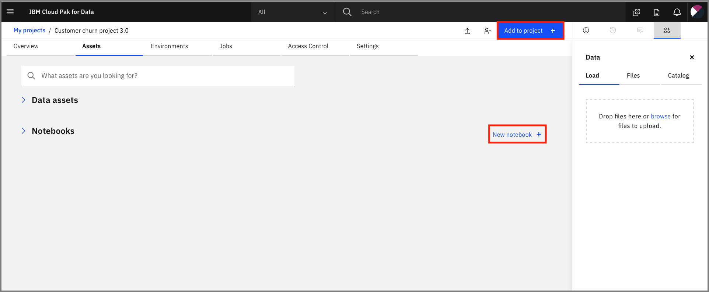
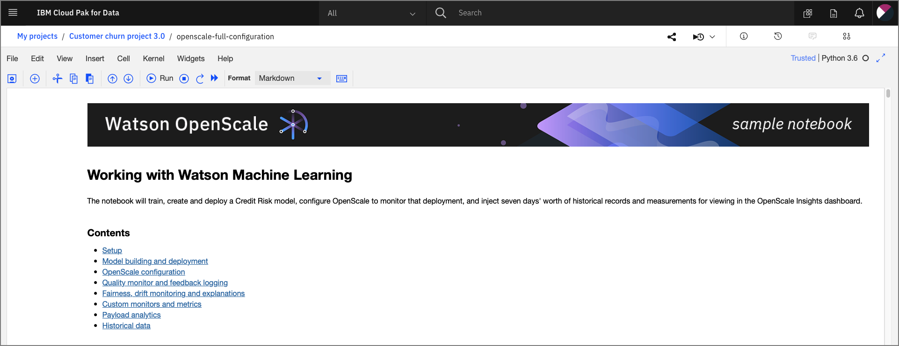

# Configure OpenScale in a Jupyter Notebook

For this exercise we're going to configure our Watson OpenScale service by running a Jupyter Notebook. This provides examples of using the OpenScale Python APIs programatically.

## Import the notebook

At the project overview click the *New Asset* button, and choose *Add notebook*.



On the next panel select the *From URL* tab, give your notebook a name, provide the following URL, and choose the Python 3.6 environment:

```bash
https://raw.githubusercontent.com/IBM/cloudpakfordata-telco-churn-workshop/master/notebooks/ConfigureOpenScale.ipynb
```

> The notebook is hosted in the same repo as [the workshop](https://github.com/IBM/cloudpakfordata-telco-churn-workshop).
>
> * **Notebook**: [ConfigureOpenScale.ipynb](https://github.com/IBM/cloudpakfordata-telco-churn-workshop/blob/master/notebooks/ConfigureOpenScale.ipynb)
> * **Notebook with output**: [with-output/ConfigureOpenScaleOutput.ipynb](https://github.com/IBM/cloudpakfordata-telco-churn-workshop/blob/master/notebooks/with-output/ConfigureOpenScaleOutput.ipynb)


When the Jupyter notebook is loaded and the kernel is ready then we can start executing cells.



### Update credentials

* In the notebook section 1.2 you will add your ICP platform credentials.
* For the `url` field, change `https://w.x.y.z` to use the IP address of your ICP cluster, i.e for today's workshop on 9/19/19 it will be `"url": "169.54.164.135"`.
* For the `username`, use your login username.
* For the `password`, user your login password.

### Run the notebook

> **Important**: *Make sure that you stop the kernel of your notebook(s) when you are done, in order to prevent leaking of memory resources!*


Spend an minute looking through the sections of the notebook to get an overview. You will run cells individually by highlighting each cell, then either click the `Run` button at the top of the notebook. While the cell is running, an asterisk (`[*]`) will show up to the left of the cell. When that cell has finished executing a sequential number will show up (i.e. `[17]`).

### Get transactions for Explainability

Under `8.9 Identify transactions for Explainability` run the cell. It will produce a series of UIDs for indidvidual ML scoring transactions. Copy one or more of them to examine in the next section.
