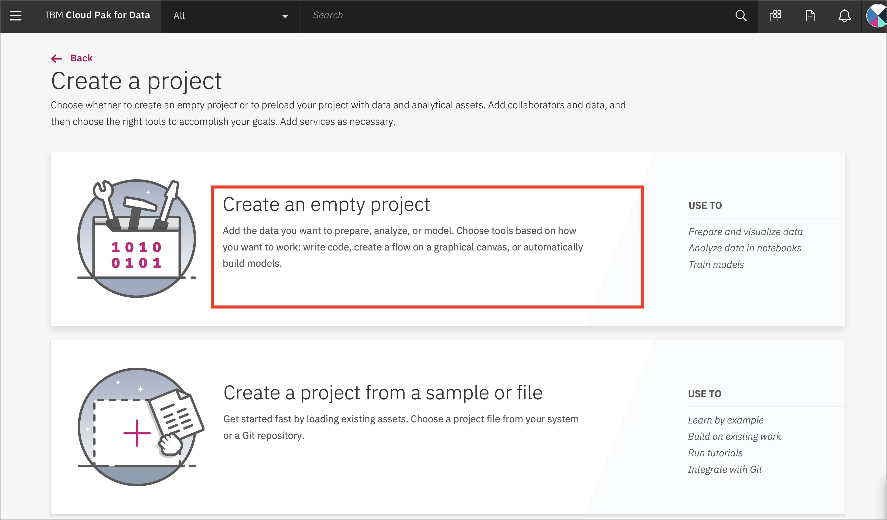
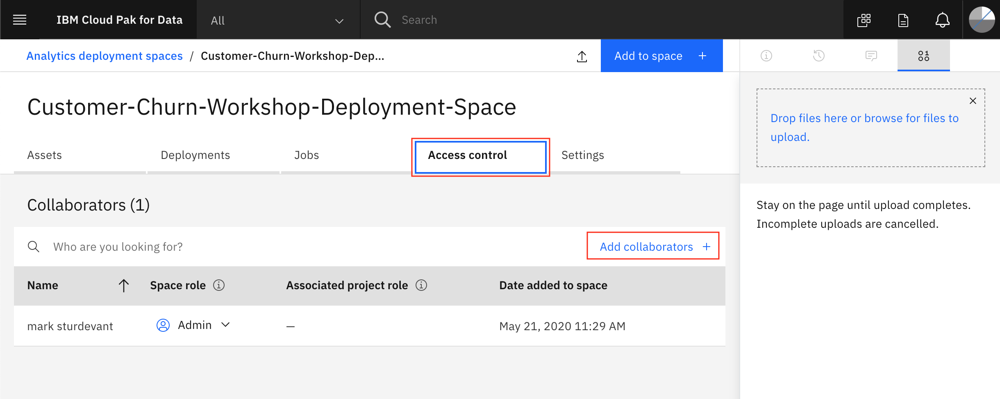
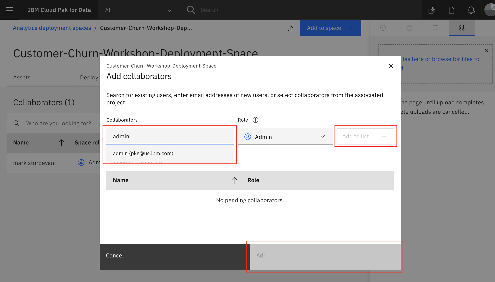

# Pre-work

This section is broken up into the following steps:

1. [Download or Clone the repo](#1-download-or-clone-the-repo)
1. [About the data set](#2-about-the-data-set)
1. [Creating a new Cloud Pak for Data project](#3-create-a-project-and-space)
1. [Create a Space for Machine Learning Deployments](#4-create-a-space-for-machine-learning-deployments)

## 1. Download or clone the repo

Various parts of this workshop will require the attendee to upload files or run scripts that we've stored in the repository. So let's get that done early on, you'll need [`git`](https://git-scm.com) on your laptop to clone the repository directly, or access to [GitHub.com](https://github.com/) to download the zip file.

To Download, go to the [GitHub repo for this workshop](https://github.com/IBM/cloudpakfordata-telco-churn-workshop) and download the archived version of the workshop and extract it on your laptop.


Alternately, run the following command:

```bash
git clone https://github.com/IBM/cloudpakfordata-telco-churn-workshop
cd cloudpakfordata-telco-churn-workshop
```

## 2. About the data set

The data set used for this workshop is originally from Watson Analytics and was used on a [Kaggle](https://www.kaggle.com/blastchar/telco-customer-churn) project, it contains information about customer churn for a Telecommunications company. The data is split into three CSV files and are located in the [data](https://github.com/IBM/cloudpakfordata-telco-churn-workshop/tree/master/data/split) directory of this repository.

### **[billing.csv](../../data/split/billing.csv)**

This file has the following attributes:

* Customer ID
* Contract *(Month-to-month, one year, two year)*
* Paperless Billing *(Yes, No)*
* Payment Method *(Bank transfer, Credit card, Electronic check, Mailed check)*
* Monthly Charges *($)*
* Total Charges *($)*
* Churn *(Yes, No)*

### **[customer-service.csv](../../data/split/customer-service.csv)**

* Customer ID
* Gender *(Male, Female)*
* Senior Citizen *(1, 0)*
* Partner *(Yes, No)*
* Dependents *(Yes, No)*
* Tenure *(1-100)*

### **[products.csv](../../data/split/products.csv)**

* Customer ID
* Phone Service *(Yes, No)*
* Multiple Lines *(Yes, No, No phone service)*
* Internet Service *(DSL, Fiber optic, No)*
* Online Security *(Yes, No, No internet service)*
* Online Backup *(Yes, No, No internet service)*
* Device Protection *(Yes, No, No internet service)*
* Tech Support *(Yes, No, No internet service)*
* Streaming TV *(Yes, No, No internet service)*
* Streaming Movies *(Yes, No, No internet service)*

## 3. Create a Project and Space

At this point of the workshop we will be using Cloud Pak for Data for the remaining steps.

### Log into Cloud Pak for Data

Launch a browser and navigate to your Cloud Pak for Data deployment

> **NOTE** Your instructor will provide a URL and credentials to log into Cloud Pak for Data!


### Create a new project

Go the (☰) menu and click *Projects*


Click on *New project*


Click on the top tile for `Create an empty project`:



Give the project a unique name and click `Create`:


### Create a Space for Machine Learning Deployments

Go the (☰) menu and click `Analyze` -> `Analytics deployments`:


Click on `+ New deployment space`:


Give your deployment space a unique name, optional description, then click `Create`. You will use this space later when you deploy a machine learning model.

Next, we will add a collaborator to the new deployment space, so that assets we deploy can be monitored in the model monitoring lab.

Click on your new deployment space.


Click on the `Access control` tab and then click on `Add collaborators` on the right.



Enter "admin" as a Collaborator and select the user from the drop down list. Then click on the `Add to list` button.



Click the `Add` button to finish adding the collaborator. You should be brought back to the deployment space page and see your user ID along with the `Admin` user as collaborators for this space.
