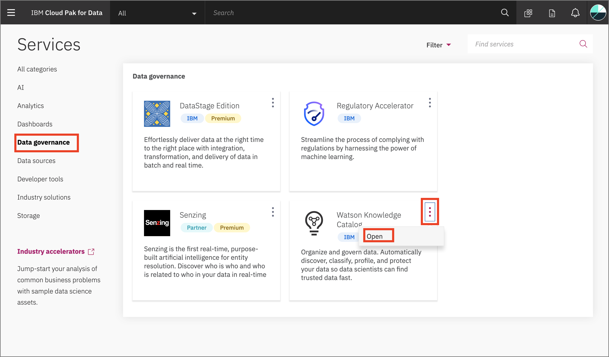
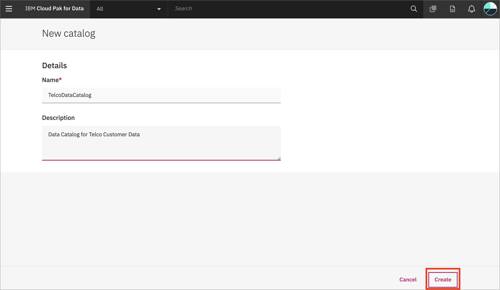
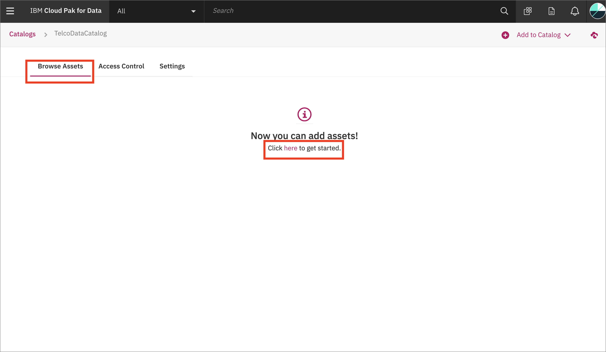
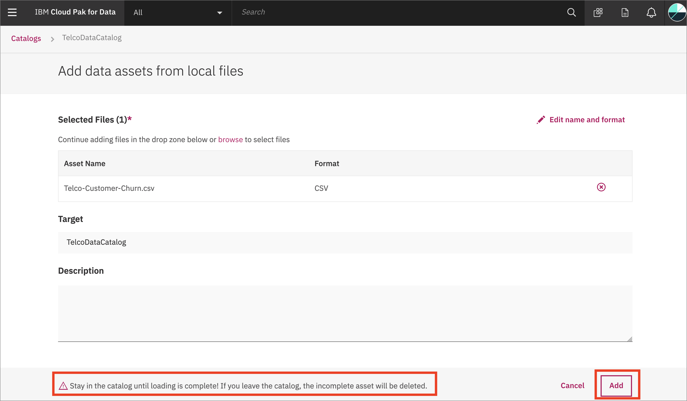
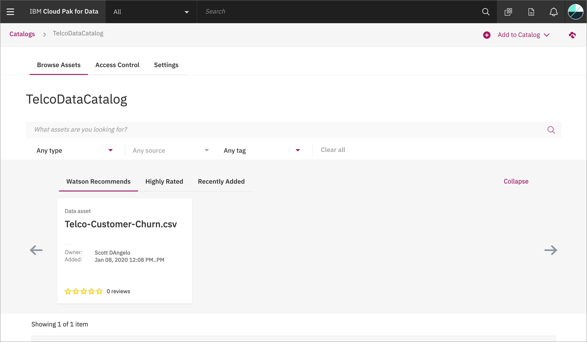
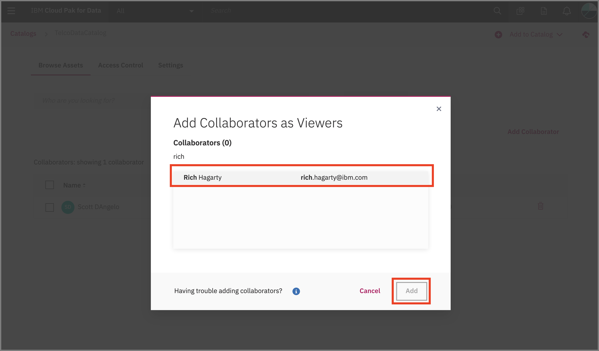
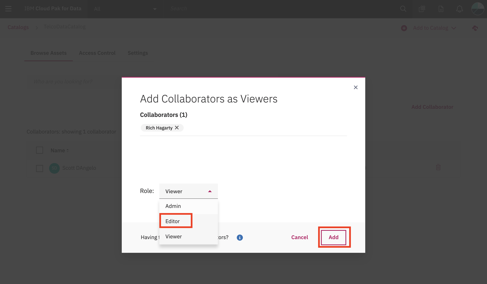
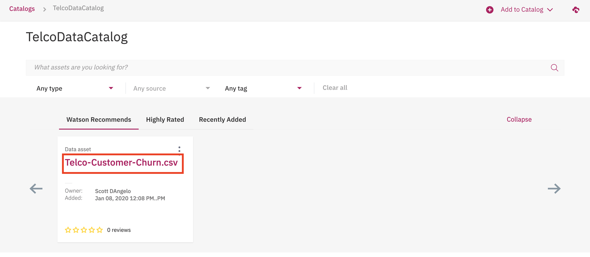
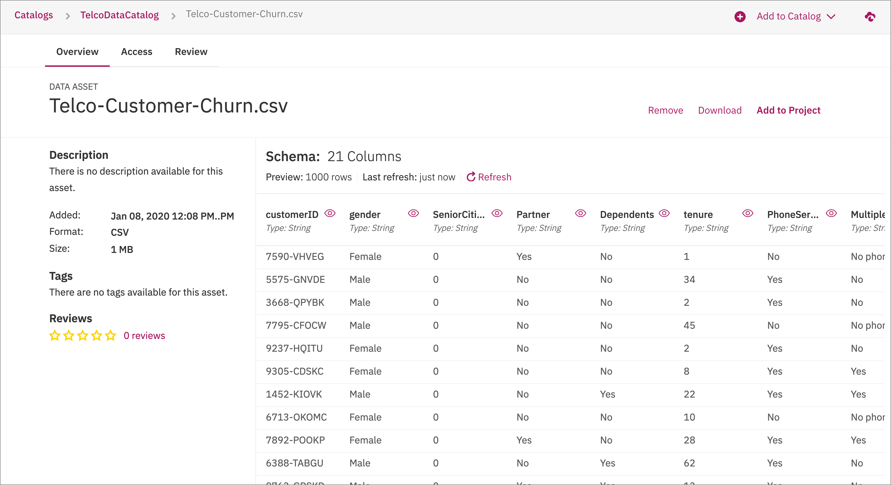

# Watson Knowledge Catalog

This exercise demonstrates how to solve the problems of enterprise data governance using Watson Knowledge Catalog on the Cloud Pak for Data platform. We'll explain how to use governance, data quality and active policy management in order to help your organization protect and govern sensitive data, trace data lineage and manage data lakes. This knowledge will help users quickly discover, curate, categorize and share data assets, data sets, analytical models and their relationships with other members of your organization. It serves as a single source of truth for data engineers, data stewards, data scientists and business analysts to gain self-service access to data they can trust.

This section is comprised of the following steps:

1. [Set up Catalog and Data](#1-set-up-catalog-and-data)
1. [Add collaborators and control access](#2-add-collaborators-and-control-access)

## 1. Set up Catalog and Data

First we'll create a catalog and load some data

### Create the catalog

Open Watson Knowledge Catalog by clicking the *Services* icon at the top right of the home page:

Under the *Data Governance* section, click the 3 horizontal dots and click `Open`:

From the *Your catalogs* page, click either `Create catalog` or `New Catalog`:

Give your catalog a name and optional description, and click `create`:

### Add data assets

Under the *Browse Assets* tab, below "Now you can add assets!" click `here` to add your data:

*OR* you can click `+ Add to catalog` in the top right and choose `Local files`:

Browse to the `/data/merged/Telco-Customer-Churn.csv` file and double-click or click `Open`. Add an optional description and click `Add`:

>NOTE: Stay in the catalog until loading is complete! If you leave the catalog, the incomplete asset will be deleted.

The newly added *Telco-Customer-Churn.csv* file will show up under the *Browse Assets* tab of your catalog:

## 2. Add collaborators and control access

Under the *Access Control* tab you can click `Add Collaborator` to give other users access to your catalog:

You can search for a user, click on the name to select them, and click `Add`:

You can choose a role for the user - Admin, Editor, or Viewer:

To access data in the catalog, click on the name of the data:

A preview of the data will open, with metadata and the first few rows:

You can click the `Review` tab and rate the data, as well as comment on it, to provide feedback for your teammates:

